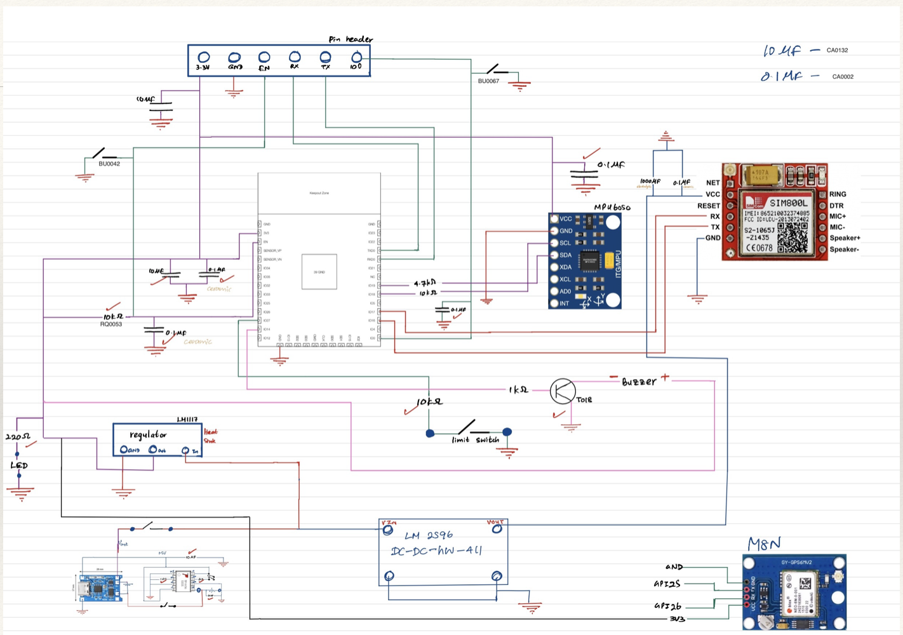
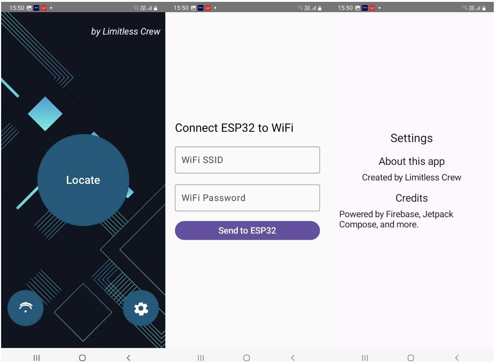
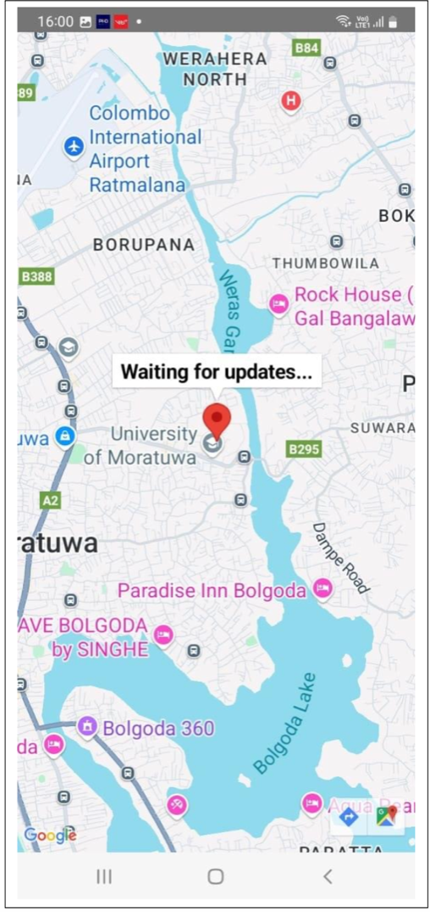
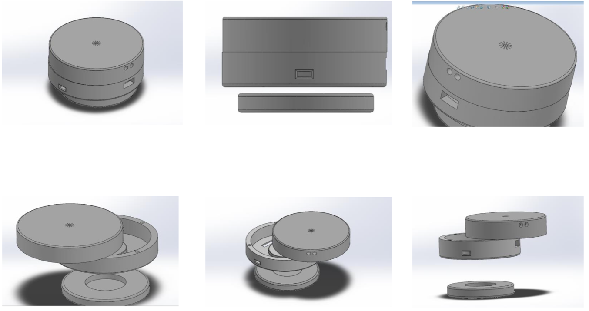
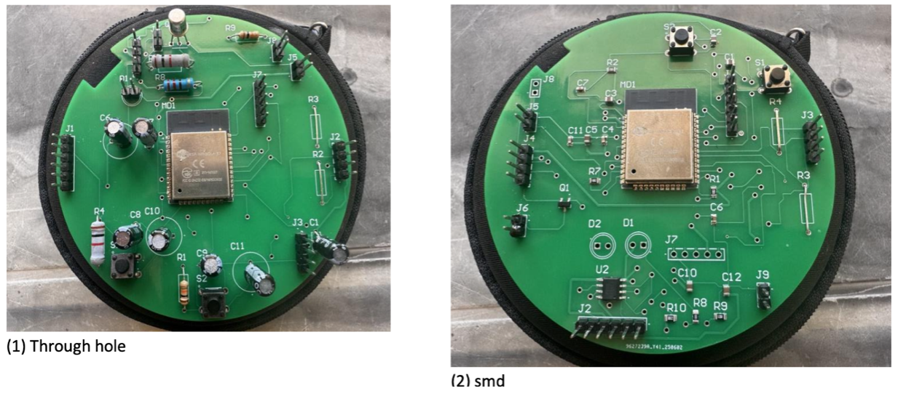
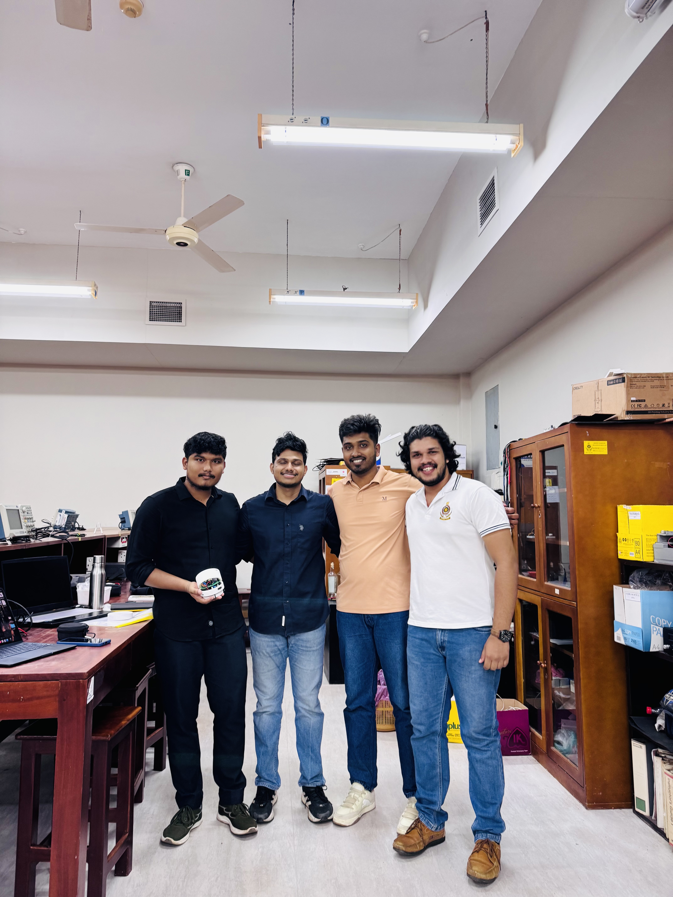

# MagTag — Smart Anti-Theft Bag Tag

> An IoT-based smart bag security system for theft detection, real-time tracking, and user alerts.

  

  <b>ESP32 • MPU6050 • NEO-M8N GPS • Firebase • Android App</b>

---

## Overview

In modern daily life, bags are no longer just simple carriers. They often hold valuable and essential personal belongings such as laptops, documents, wallets, keys, and other important items. As a result, protecting bags from theft or unauthorized access has become increasingly important.

**MagTag** is a smart anti-theft bag tag designed to improve bag security through embedded sensing, wireless communication, and cloud connectivity. The system detects suspicious motion or forced opening attempts, activates a buzzer alert, and sends real-time status and location information to a cloud database. This allows the user to monitor the bag remotely through a mobile application.

This project was developed as an engineering design solution to provide an affordable, practical, and user-friendly security device for students, professionals, and travelers.

---

## Problem Statement

Bag theft is a common issue in public places, educational institutions, workplaces, and transport environments. Thieves often target unattended or partially visible bags and can act quickly before the owner notices.

Conventional bags usually do not include any active security mechanism. Even when surveillance systems exist, theft may only be discovered after the incident. This creates a need for a compact, smart, and affordable device that can:

- detect suspicious bag movement
- identify opening or separation events
- notify the user in real time
- provide location information for recovery assistance

MagTag is proposed as a response to this need.

---

## Proposed Solution

MagTag is a compact embedded device built around the **ESP32-WROOM-32** microcontroller. It combines motion sensing, opening detection, GPS tracking, Wi-Fi connectivity, and cloud updates to create a practical anti-theft solution.

The system uses:

- an **MPU6050** sensor for motion detection
- a **limit switch / separation trigger** for opening detection
- a **NEO-M8N GPS module** for location tracking
- a **buzzer** for immediate audible alerting
- **Firebase Realtime Database** for remote monitoring
- a **mobile application** for user interaction and status viewing

Once suspicious activity is detected, the device sends the event status and GPS coordinates to the cloud so that the bag’s condition can be monitored remotely.

---

## Key Features

- Motion-based theft detection using the MPU6050
- Opening / separation detection using a switch mechanism
- Real-time GPS location upload
- Wi-Fi setup through ESP32 access point mode
- Cloud synchronization using Firebase Realtime Database
- Audible alert using onboard buzzer
- Remote monitoring through a mobile app
- Compact embedded hardware suitable for bag integration
- Designed with affordability and practical deployment in mind

---

## System Architecture

  

The overall system consists of the following layers:

### 1. Sensing Layer
This layer detects physical events associated with theft or unauthorized handling.

- **MPU6050** detects sudden motion or abnormal movement
- **Limit switch / magnetic separation mechanism** detects opening or removal-related events

### 2. Processing Layer
The **ESP32-WROOM-32** acts as the central controller. It reads sensor data, applies event logic, manages Wi-Fi communication, and controls alert behavior.

### 3. Tracking Layer
The **NEO-M8N GPS module** provides latitude and longitude information when the device needs to report its location.

### 4. Communication Layer
The ESP32 connects to Wi-Fi and uploads device data to **Firebase Realtime Database** using secure HTTP communication.

### 5. User Layer
The user accesses status information through a **mobile application**, which can display alerts and bag location data.

---

## Hardware Components

| Component | Purpose |
|---|---|
| ESP32-WROOM-32 | Main microcontroller and Wi-Fi communication |
| MPU6050 | Motion sensing |
| NEO-M8N GPS Module | Real-time location tracking |
| Limit Switch / Separation Trigger | Detects opening or physical trigger events |
| Buzzer | Audible theft alert |
| Rechargeable Batteries | Portable power supply |
| USB-to-TTL Converter (FTDI) | Firmware uploading and debugging |

---

## Hardware Setup

The device is built as a compact embedded module intended to be attached to or integrated with a bag. The sensor and alert components work together to detect suspicious activity while maintaining portability.

---

## Software Stack

- **Arduino IDE** for firmware development and upload
- **Embedded C/C++** for ESP32 firmware
- **Firebase Realtime Database** for cloud storage and synchronization
- **Android Studio** for mobile application development

---

## Firmware Summary

The firmware is responsible for:

- starting ESP32 Wi-Fi access point mode for initial setup
- receiving Wi-Fi credentials through a browser-based form
- connecting the device to a Wi-Fi network
- initializing the sensors and GPS module
- detecting motion and limit switch triggers
- sending status updates and GPS data to Firebase
- activating buzzer alerts during suspicious events

Main functional blocks include:

- Wi-Fi setup portal
- Firebase connection notification
- GPS data upload
- motion and trigger detection
- alert logic and cooldown timing

---

## Mobile Application

  

  

The mobile application is intended to provide a simple interface for monitoring bag security information. It can be extended to support:

- live device status
- GPS location viewing
- theft notifications
- event history
- user-specific monitoring and control

---
## Firebase Integration

The project uses **Firebase Realtime Database** to store:

- device connection status
- motion alert state
- limit switch trigger state
- latitude and longitude
- timestamps of reported events

## Enclosure Concept

  

The enclosure is designed to protect the electronics while keeping the device lightweight and portable. The structure should support:

- secure component placement
- ease of bag attachment
- wire protection
- compact packaging
- user-friendly access for charging and maintenance

---
## PCB Design

  

The MagTag hardware is intended to be implemented on a compact custom PCB to improve reliability, portability, and ease of integration into the final enclosure. A dedicated PCB helps reduce loose wiring, improves mechanical strength, and makes the device more suitable for real-world use as a bag-mounted product.

The PCB is designed to accommodate the core embedded and interface components required for sensing, alerting, and communication. The layout is planned with attention to compactness, accessibility, and practical assembly.

## Team Members

- Athukorala U.R.
- Fernando W.H.D.
- Kumarasinghe M.N.
- Ranasinghe A.G.N.S.

  

